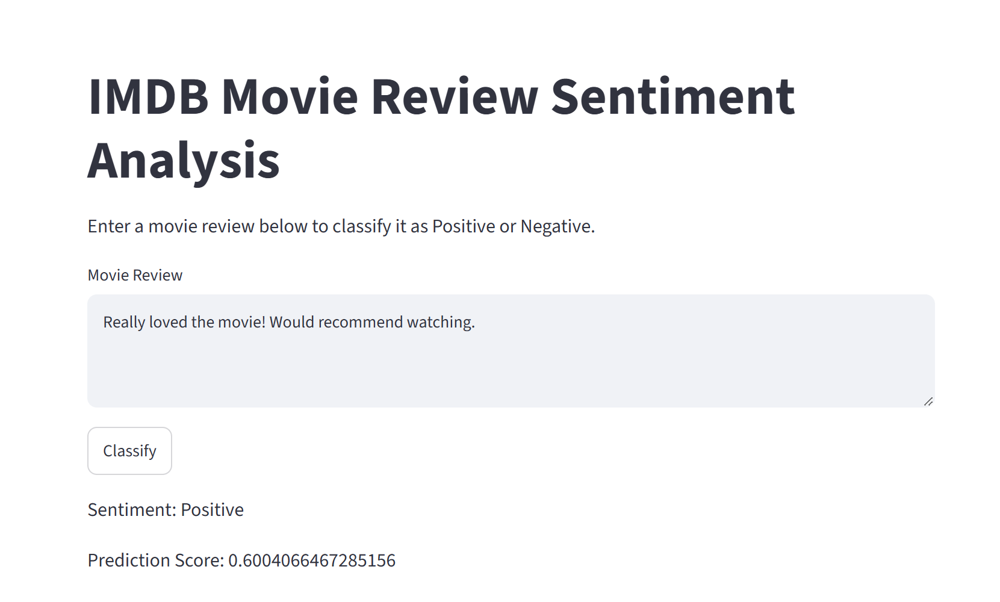

🎬 IMDB Movie Review Sentiment Prediction

A Deep Learning application that predicts whether an IMDB movie review is Positive or Negative using a Simple Recurrent Neural Network (RNN) built with TensorFlow/Keras and deployed using Streamlit.

📸 Application

🧠 Model

The project uses a Simple RNN for binary sentiment classification.

Movie Review
     ↓
Text → Integer Sequence
     ↓
Padding (500 tokens)
     ↓
Embedding Layer
     ↓
SimpleRNN (128 units)
     ↓
Dense + Sigmoid
     ↓
Positive / Negative
Model Architecture
Layer	Configuration
Embedding	10,000 vocabulary × 128 dimensions
SimpleRNN	128 units
Dense	1 neuron
Activation	Sigmoid
Sequence Length	500

The trained model is stored in simple_rnn_imdb.h5.

🛠️ Technologies
Python
TensorFlow / Keras
NumPy & Pandas
Scikit-learn
Matplotlib
Streamlit
📂 Project Structure
IMDB-movie-review-sentiment-prediction/
│
├── data/
│   └── imdb_word_index.json
├── screenshots/
│   └── app_screenshot.png
├── embedding.ipynb
├── prediction.ipynb
├── simplernn.ipynb
├── main.py
├── simple_rnn_imdb.h5
├── requirements.txt
└── README.md

⚙️ Run Locally
1. Clone the repository
git clone https://github.com/Anicodes18/IMDB-movie-review-sentiment-prediction.git
cd IMDB-movie-review-sentiment-prediction
2. Install dependencies
pip install -r requirements.txt
3. Run the application
streamlit run main.py

🔑 Key Concepts
Natural Language Processing
Text preprocessing and sequence padding
Word embeddings
Recurrent Neural Networks
Binary sentiment classification
TensorFlow/Keras
Streamlit deployment